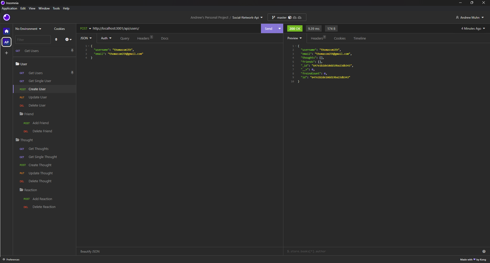
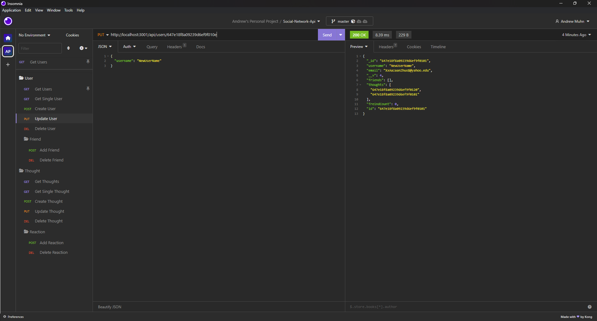

# Social Network Api

## Description

- The goal was to create a mock e-commerce back end to familiarize myself with e-commerce databases functionality
- I was able to better utilize CRUD to manage data
- I was able to utilze the sequilize package as my ORM instead of writing raw SQL

## Table of Contents

- [Installation](#installation)
- [Usage](#usage)
- [Credits](#credits)

## Installation

- Clone the [repo](https://github.com/andrewmuhn/social-network-api) to your local machine.
- Navigate to that file directory and run from your terminal:

```bash
	npm i
```

> **Note**: Node.js and npm need to be installed to perform this action. Installing Node.js will also install npm

- Then in order to seed the database run from your terminal:

```bash
	npm run seed
```

> **Note**: MongoDB needs to be installed in order to run these commands.

## Usage

- Follow the above installation steps to get started.
- Then run from your terminal:

```bash
	npm start
```

USER ROUTES:

View all Users

View Single User

Create User

Update User

Delete User

Add Friend

Delete Friend


THOUGHT ROUTES:

View all Thoughts

View Single Thought

Create Thought

Update Thought

Delete Thought

Add Reaction

Delete Reaction


[Link to repo](https://github.com/andrewmuhn/social-network-api)

[Link to video walkthrough of application](https://drive.google.com/file/d/1SQMS84Ae07rKwbHMb_6qO9N61eiBgOZX/view)

## Credits

Project created by [Andrew Muhn](https://github.com/andrewmuhn)
as part of UofO Edx Bootcamp

Utilized:

- [node.js](https://nodejs.org/en/about)
- [express](https://www.npmjs.com/package/express)
- [mongoDB](https://www.mongodb.com/)
- [mongoose](https://mongoosejs.com/)
- [nodemon](https://www.npmjs.com/package/nodemon)

Credits to tutorials and forums used:

[mongoose schema match syntax](https://stackoverflow.com/questions/18022365/mongoose-validate-email-syntax)
